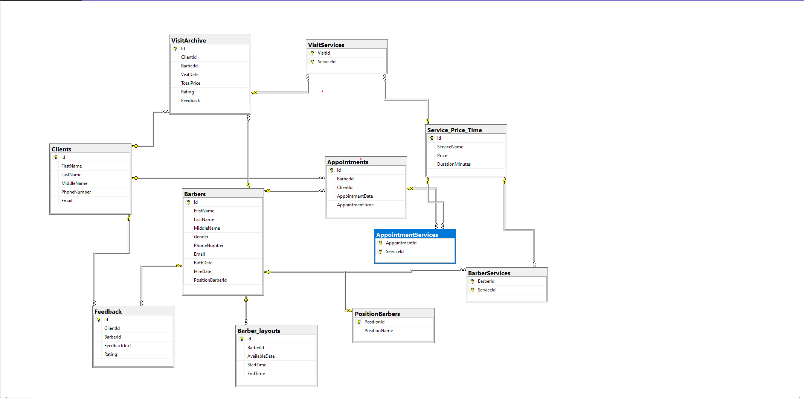

# 💈 Barbershop SQL Database Project

## 📖 About the Project
This project represents a relational database for a barbershop management system.

The database was designed and implemented from scratch using SQL Server.
Synthetic data was generated to simulate real-world usage.

## 🎯 Objectives
- Design relational database
- Implement business logic using SQL
- Optimize queries with indexes
- Perform business analytics

## 🛠 Tech Stack
- SQL Server
- T-SQL

## 🔥 Project Highlights
- Designed normalized relational database
- Implemented many-to-many relationships
- Created stored procedures for business logic
- Used triggers for data validation
- Built analytical queries for business insights

## 📂 Project Structure
- schema/
- data/
- logic/
- analytics/

## 🧱 Database Structure
Main entities:
- Barbers
- Clients
- Services
- Appointments
- Visit Archive
- Feedback

## 🗺 Database Schema

## ⚙️ Features
- Primary & Foreign Keys
- Stored Procedures
- Views
- Triggers
- Indexes (filtered, include)

## 📊 Analytics
- Top barbers by revenue
- Most popular services
- Average check
- Customer retention
- Workload analysis

## 🚀 How to Run
1. Run schema scripts
2. Insert data
3. Execute logic scripts
4. Run analytics queries

## ⚠️ Notes
- Data is randomly generated

## 👨‍💻 Author
Dmytro
